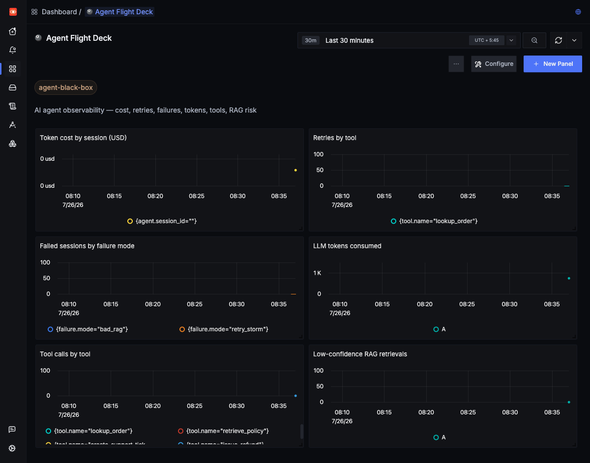

# Agent Black Box: a flight recorder and SRE copilot for AI agents, built on SigNoz

An AI agent that fails in production is hard to debug, because the interesting part happened inside a chain of LLM calls and tool calls you never saw. My hackathon project records every one of those steps into SigNoz, then has a second agent read the telemetry back and explain what went wrong. This is what I built, what broke along the way, and what the telemetry looked like.

## What I built

Agent Black Box has two halves. The first is a customer-support agent (a small LangGraph graph) that handles refund tickets by calling tools: look up the order, retrieve the refund policy from a vector store, decide, and reply. Every LLM call, tool call, retry, and RAG lookup is instrumented with OpenTelemetry and shipped to a self-hosted SigNoz.

The second half is an SRE copilot. When the agent misbehaves, SigNoz fires an alert to a webhook, and the copilot turns that alert plus the surrounding telemetry into a root-cause report with a suggested fix. The whole thing runs against SigNoz installed via Foundry, and the `casting.yaml` + lockfile are in the repo so the deployment reproduces.

The agent task itself is deliberately boring. The point is the observability, so I gave the agent three ways to break on purpose.

## How the agent breaks

Each failure is a deterministic switch, so I can reproduce the same incident before and after a fix:

- Retry storm: the order-lookup tool returns HTTP 503 and the agent retries with no budget, burning time and tokens.
- Bad RAG: the vector search returns the wrong policy document with a low confidence score, and a valid refund gets denied.
- Tool loop: ambiguous retrieval keeps confidence low, so the agent re-queries the same policy in a loop.

These are the failure classes the hackathon brief calls out, and they map cleanly onto telemetry: a retry storm is a span that repeats, a bad retrieval is a low `rag.confidence` attribute, a loop is one span name appearing over and over in a trace.

## What SigNoz records

Each support session becomes a single trace, `support_agent.session`, with the LLM turns and tool calls nested underneath. The LLM spans follow the OpenTelemetry GenAI semantic conventions, so `gen_ai.request.model`, `gen_ai.usage.input_tokens`, `gen_ai.usage.output_tokens`, and a computed `gen_ai.usage.cost_usd` all sit on the span. A tool-loop session shows up as a tall waterfall of `tool.retrieve_policy` spans, which is exactly the shape of the bug.

Metrics feed a dashboard I called the Agent Flight Deck: token cost, retries by tool, failed sessions by failure mode, tool calls, and low-confidence retrievals.



Logs are bridged through the OTel logging handler, so every structured log line the agent writes carries its trace and span IDs. Clicking a spike on a trace lands on the log that explains it, without matching timestamps by hand.

The instrumentation setup is small. A resource, three OTLP exporters, and a logging handler:

```python
resource = Resource.create({
    "service.name": "agent-black-box",
    "service.version": AGENT_VERSION,
    "service.instance.id": "agent-black-box-agent-1",  # see "what surprised me"
})
tracer_provider = TracerProvider(resource=resource)
tracer_provider.add_span_processor(
    BatchSpanProcessor(OTLPSpanExporter(endpoint=f"{ENDPOINT}/v1/traces")))
```

## From an alert to a root cause

I built a metric alert in SigNoz on `agent.retries` grouped by `tool.name`, routed to a webhook channel pointed at the copilot. When a retry storm happens, SigNoz posts an Alertmanager-style payload to the copilot, carrying the failure mode, the tool, and the observed value in the annotation text.

The copilot reads that payload, pulls the evidence, and writes a report. Here is a real one, from a real alert:

```
Incident: Retry Storm in tool lookup_order
- Observed value: 11 (threshold 5)
- Tool: lookup_order
- Failing span: tool.lookup_order
Likely root cause: lookup_order retried an upstream 503 with no
retry budget and no fallback path.
Suggested fixes:
1. Add max_retries=3 with exponential backoff to lookup_order.
2. Add a fallback: create_support_ticket when the order API is unavailable.
```

The rule I held myself to: every line in the report has to trace back to telemetry the copilot actually read. The LLM writes the prose; it does not invent the number 11 or the span name. If evidence is missing, the report says so.

## The fix, then a replay

The copilot suggested a retry budget with a fallback, so I shipped exactly that as v2 behavior, controlled by one config value. `RETRY_BUDGET=0` is the buggy v1 that storms. `RETRY_BUDGET=3` is the fixed v2 that gives up after three tries and opens a support ticket instead.

Replaying the same scenario on v2, the `tool.lookup_order` span now records three retries instead of eleven, the session ends with `failure_mode=none`, and the retry-storm alert stops firing because the peak retry count drops below the threshold. In the trace, the loud red span becomes a short one with a graceful fallback next to it. That before-and-after, driven by the same seed and visible in the same trace view, is the story I wanted the tool to tell.

## What surprised me

The instrumentation was the easy part. Getting a metric alert to actually fire taught me the most, and none of it is in a quickstart.

SigNoz's `rate()` and `increase()` returned zero for my retry counter, even though ClickHouse clearly showed eleven retries. Two things were wrong. First, every agent run is a short-lived process, and the OpenTelemetry SDK stamps a fresh `service.instance.id` on each one, so a single metric fractured into thirty-one separate short series. Pinning a stable instance id fixed that. Second, `increase` needs a series that rises across the window, but these counters jump to eleven and vanish in thirteen seconds, so the delta reads as zero. Switching the alert to `max` (the peak value in the window) gave me the number I wanted, and it reads naturally: the worst session had more than five retries.

I also learned that a high-cardinality label like `session_id` on a metric is a trap. It makes every session its own series and breaks aggregation. Session id belongs on traces and logs, where it does the correlation work; the metrics stay low-cardinality.

Two more that cost real time: SigNoz evaluates alerts on a delayed window (about two minutes behind now), so fresh data sits in a blind spot and the rule reads "query result is nil" until you widen the window. And after a Docker restart, SigNoz's replicated ClickHouse tables came up read-only, which looks exactly like "no data" in the UI until you run `SYSTEM RESTORE REPLICA` on them. Both are written up in the repo so the next person does not lose the afternoon I did.

## Wrapping up

The build proves a simple claim: with OpenTelemetry and SigNoz, an AI agent stops being a black box. You can watch a session as a trace, chart its cost and retries, get paged when it storms, and read a root-cause report grounded in the telemetry instead of a guess. Code, the reproducible Foundry deployment, and the full debugging notes are in the repo.

- Repository: https://github.com/SamipSGz/agent-black-box
- SigNoz install docs: https://signoz.io/docs/install/docker/
- OpenTelemetry GenAI semantic conventions: https://opentelemetry.io/docs/specs/semconv/gen-ai/
