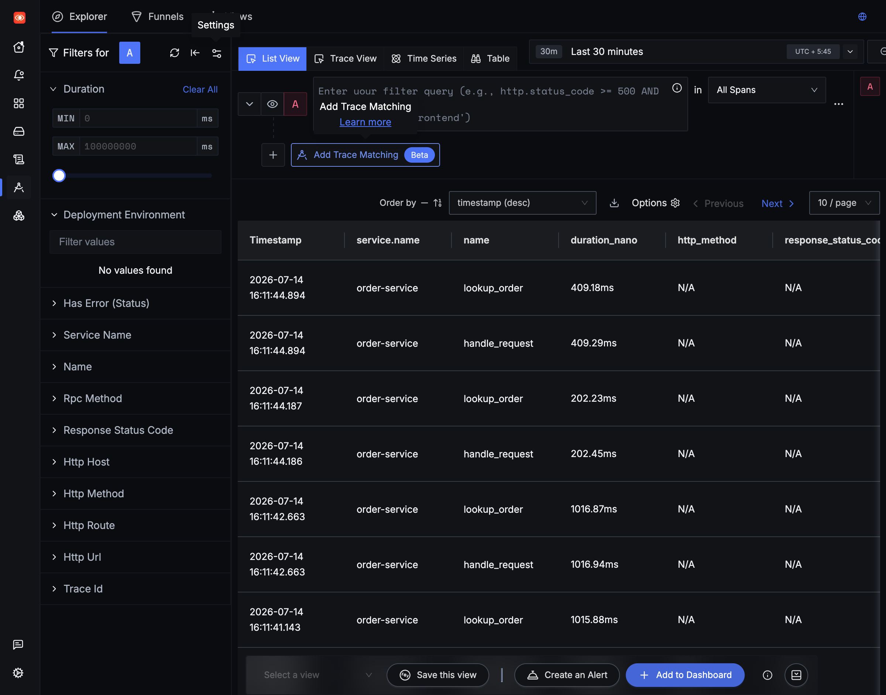
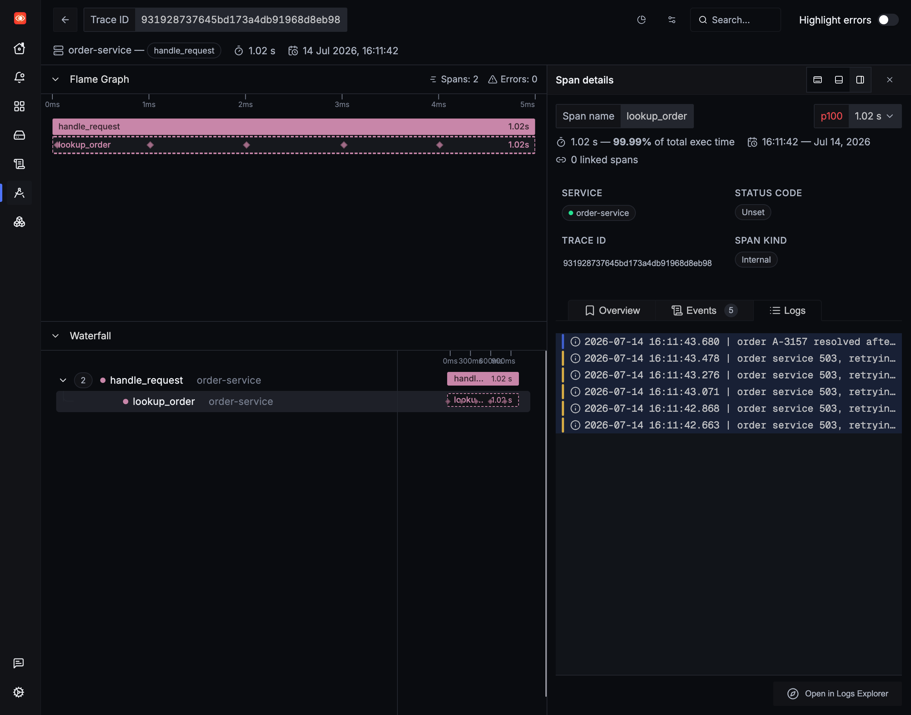
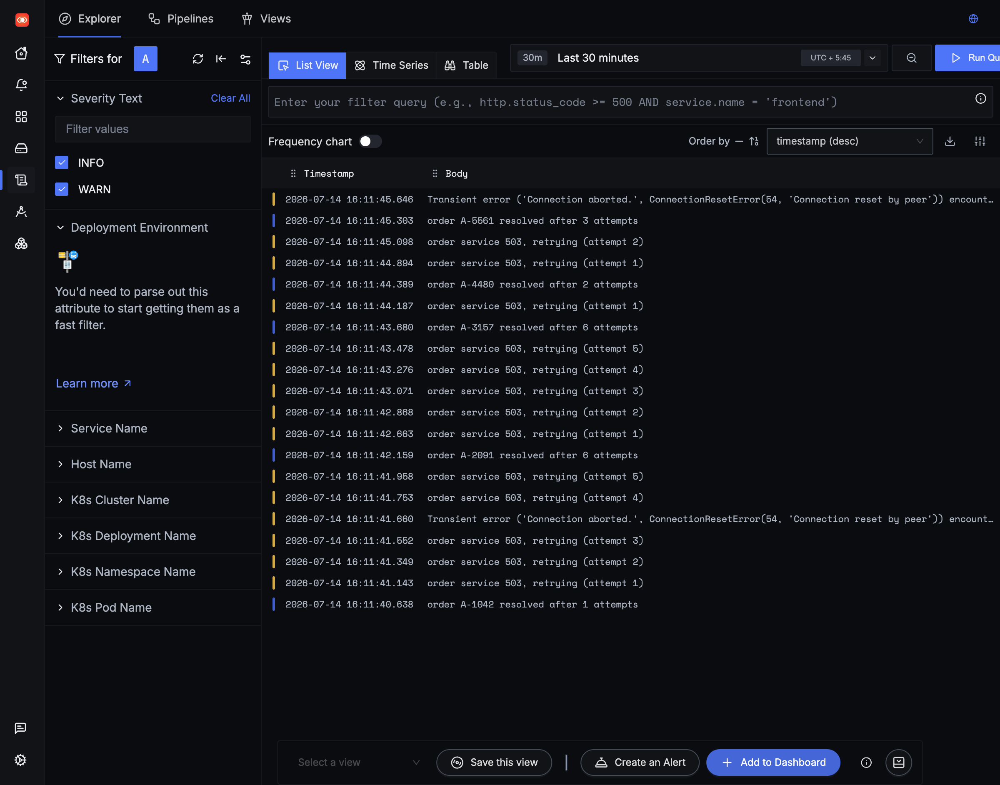
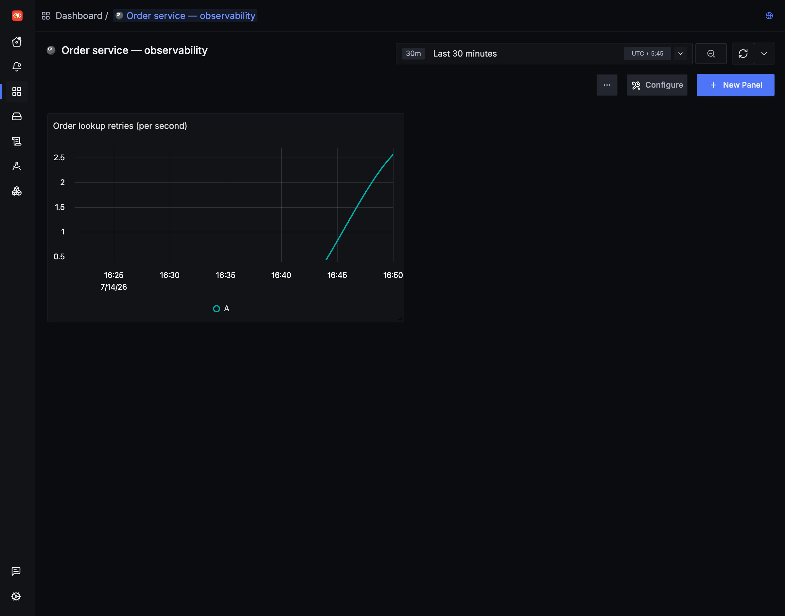

# Jumping from a log line to the exact trace that caused it, with self-hosted SigNoz

A service in front of me was slow maybe one request in ten, and the logs just said `503, retrying`. Retrying how many times? Inside which request? The logs and the traces lived in two different tabs and I was matching them up by hand, squinting at timestamps. This is a walkthrough of how I self-hosted SigNoz, sent traces and logs from a small Python service, and got a log line to link straight to the trace that produced it. That one link is the feature I ended up liking most.

## What I was trying to do

SigNoz is an OpenTelemetry-native observability tool you can run on your own machine, so traces, logs, and metrics land in one place instead of three vendors. I did not want the full production setup. I wanted the smallest thing that would answer one question: when a log says a request retried, can I click that log and see the whole request as a trace?

For that I needed two pieces sending data to SigNoz over OTLP: spans for the request, and logs emitted while a span is active. If the logs carry the trace ID, SigNoz can connect them.

## Installing SigNoz (the part where my first instructions were wrong)

Most guides I found said to clone the repo and run `docker compose up` from `deploy/docker`. I did that, and the folder was not there. The `main` branch has deprecated the Compose manifests. `deploy/README.md` now says so directly and points to a tool called Foundry. That was my first real lesson: check the current install docs, because the internet is a few months behind.

The current path is three steps. Install the CLI:

```bash
curl -fsSL https://signoz.io/foundry.sh | bash
```

Write a `casting.yaml`:

```yaml
apiVersion: v1alpha1
kind: Installation
metadata:
  name: signoz
spec:
  deployment:
    flavor: compose
    mode: docker
```

Then deploy:

```bash
foundryctl cast -f casting.yaml
```

Foundry generates the Compose files, validates Docker, and starts the containers. A minute later `docker ps` showed the stack running: a `signoz` container publishing the UI on `8080`, and an `ingester` publishing OTLP on `4317` (gRPC) and `4318` (HTTP). I used HTTP because it is one less thing to think about.

The UI at `http://localhost:8080` sent me to a signup page on first run. It creates a local admin account, and the password rule is stricter than I expected: at least 12 characters with an uppercase letter, a lowercase letter, a number, and a symbol. My first two attempts bounced before I read that.

Reference: [SigNoz install docs](https://signoz.io/docs/install/docker/).

## Instrumenting a small Python service

I wrote a script that pretends to be an order service. The lookup fails with a 503 most of the time and retries until it succeeds, which is the behavior I wanted to see in a trace. The whole thing is about 40 lines.

```python
import logging
import random
import time

from opentelemetry import trace
from opentelemetry.sdk.resources import Resource
from opentelemetry.sdk.trace import TracerProvider
from opentelemetry.sdk.trace.export import BatchSpanProcessor
from opentelemetry.exporter.otlp.proto.http.trace_exporter import OTLPSpanExporter

from opentelemetry._logs import set_logger_provider
from opentelemetry.sdk._logs import LoggerProvider, LoggingHandler
from opentelemetry.sdk._logs.export import BatchLogRecordProcessor
from opentelemetry.exporter.otlp.proto.http._log_exporter import OTLPLogExporter

ENDPOINT = "http://localhost:4318"
resource = Resource.create({"service.name": "order-service"})

# traces
tracer_provider = TracerProvider(resource=resource)
tracer_provider.add_span_processor(
    BatchSpanProcessor(OTLPSpanExporter(endpoint=f"{ENDPOINT}/v1/traces"))
)
trace.set_tracer_provider(tracer_provider)

# logs, bridged into the standard logging module
logger_provider = LoggerProvider(resource=resource)
logger_provider.add_log_record_processor(
    BatchLogRecordProcessor(OTLPLogExporter(endpoint=f"{ENDPOINT}/v1/logs"))
)
set_logger_provider(logger_provider)
logging.getLogger().addHandler(LoggingHandler(logger_provider=logger_provider))
logging.getLogger().setLevel(logging.INFO)

tracer = trace.get_tracer("order-service")
log = logging.getLogger("orders")


def lookup_order(order_id: str) -> dict:
    with tracer.start_as_current_span("lookup_order") as span:
        span.set_attribute("order.id", order_id)
        attempts = 0
        while True:
            attempts += 1
            if random.random() < 0.7 and attempts < 12:
                log.warning("order service 503, retrying (attempt %d)", attempts)
                span.add_event("retry", {"attempt": attempts})
                time.sleep(0.2)
                continue
            span.set_attribute("lookup.attempts", attempts)
            log.info("order %s resolved after %d attempts", order_id, attempts)
            return {"id": order_id}


if __name__ == "__main__":
    for order_id in ["A-1042", "A-2091", "A-3157", "A-4480", "A-5561"]:
        with tracer.start_as_current_span("handle_request") as root:
            root.set_attribute("request.id", f"req-{order_id}")
            lookup_order(order_id)
        time.sleep(0.5)
    tracer_provider.shutdown()   # flush the last batch before exit
    logger_provider.shutdown()
```

Install the two packages and run it:

```bash
pip install opentelemetry-sdk opentelemetry-exporter-otlp-proto-http
python retry_demo.py
```

The piece that makes the rest work is the `LoggingHandler`. It routes Python's normal `logging` output to SigNoz, and because the log calls happen inside `start_as_current_span`, each log record picks up the active trace and span IDs. The OpenTelemetry Python docs cover this under [logs](https://opentelemetry.io/docs/languages/python/).

## Finding the traces

In the Traces explorer each run showed up as `handle_request` with a nested `lookup_order`. The default time range is the last 30 minutes, and the first load came up empty for a few seconds before the spans appeared, so give it a moment or hit refresh.



Opening one trace shows the waterfall. The trace I picked took 1.02 seconds, almost all of it inside `lookup_order`, and the span carried `lookup.attempts: 6`. The retry events I recorded sit on the span as five markers. So a retry storm looks like a retry storm here, without me counting log lines.

## The part I came for

On the span details panel there is a Logs tab. Opening it showed the log lines recorded during that span: five `503, retrying` warnings and the final `resolved after 6 attempts`, already scoped to this one request. I did not search by timestamp. The trace ID rode along on the log records, so SigNoz connected the two views instead of me doing it by eye.



There is an Open in Logs Explorer button on that panel too, which drops you into the full Logs view filtered to the same context. Going the other way, the Logs explorer shows every line the service emitted, and each one carries the trace and span IDs that make the jump back possible.



## One trace is a story; a metric is the pattern

A single trace tells me why one request was slow. It does not tell me whether retries are getting worse across all requests. For that I added one metric: a counter that ticks up every time the lookup retries.

```python
from opentelemetry import metrics
from opentelemetry.sdk.metrics import MeterProvider
from opentelemetry.sdk.metrics.export import PeriodicExportingMetricReader
from opentelemetry.exporter.otlp.proto.http.metric_exporter import OTLPMetricExporter

meter_provider = MeterProvider(
    resource=resource,
    metric_readers=[
        PeriodicExportingMetricReader(
            OTLPMetricExporter(endpoint=f"{ENDPOINT}/v1/metrics"),
            export_interval_millis=5000,
        )
    ],
)
metrics.set_meter_provider(meter_provider)
retries_counter = metrics.get_meter("order-service").create_counter(
    "order.retries", unit="1", description="order lookup retries"
)
```

Then `retries_counter.add(1, {"order.id": order_id})` on each retry. Metrics export on their own timer rather than per-span, so a script that fires a handful of requests and exits barely registers. I wrapped the request loop in a `while` that ran for a few minutes so the counter had time to climb across several export intervals.

In SigNoz I made a dashboard, added a Time Series panel, set the data source to Metrics, and picked `order.retries` with a Rate aggregation. The build flow is worth noting: the panel does not query until you press Stage and Run Query, which caught me out when the graph sat on No Data for a moment.



Now the same failure reads three ways in one tool: the trace shows a single slow request, the logs explain each retry, and the metric shows the retry rate climbing across all of them. That is the whole pitch of keeping the three signals in one place.

## What tripped me up

The deprecated Compose folder was the first thing, covered above. A few more were not obvious.

The exporter endpoint needs the signal path when you pass it to the constructor. `OTLPSpanExporter(endpoint="http://localhost:4318")` sends nothing useful. It has to be `.../v1/traces`, and logs go to `.../v1/logs`. If instead you set the `OTEL_EXPORTER_OTLP_ENDPOINT` environment variable, the SDK appends the path for you, which is the opposite of the constructor behavior and easy to mix up.

Short scripts exit before the data ships. `BatchSpanProcessor` and `BatchLogRecordProcessor` send on a timer, so a script that finishes in half a second is gone before the first batch leaves. Calling `shutdown()` on both providers at the end forces a flush. Without it I saw nothing in the UI and wrongly assumed the setup was broken.

Logs only correlate if they run inside an active span and go through the OTel handler. A `print()`, or a logger writing straight to stdout, produces a line with no trace ID, and then SigNoz has nothing to link. Every log I wanted connected had to be emitted between `start_as_current_span` and the end of that block.

## What I would take from this

The correlation is the payoff. Once logs carry trace context, the tab switching and timestamp matching from the start of this post just goes away, and a warning becomes one click from the request that caused it. The setup that buys you this is small: point the OTLP exporters at the collector, install the logging handler, and keep your log calls inside spans.

If you want to try it, the two links worth having open are the [SigNoz install docs](https://signoz.io/docs/install/docker/) and the [OpenTelemetry Python docs](https://opentelemetry.io/docs/languages/python/). Start with the retry script above, watch one trace, then open its Logs tab. That single view is what sold me.
